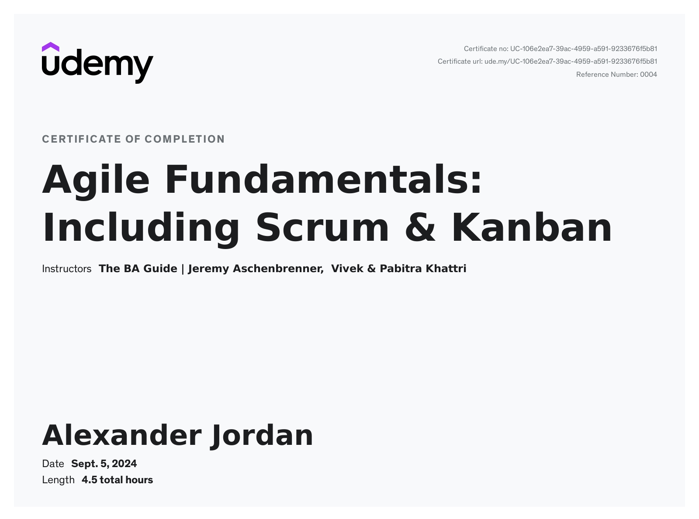

# Agile Fundamentals: Including Scrum & Kanban

These are my personal notes and resources from going through the [Agile Fundamentals: Including Scrum & Kanban](https://www.udemy.com/course/agile-fundamentals-scrum-kanban-scrumban/) course taught by [The BA Guide | Jeremy Aschenbrenner](https://www.udemy.com/user/jeremy-aschenbrenner/) & [Vivek & Pabitra Khattri](https://www.udemy.com/user/vivek-khattri-3/).

[My certification](https://www.udemy.com/certificate/UC-106e2ea7-39ac-4959-a591-9233676f5b81/):

