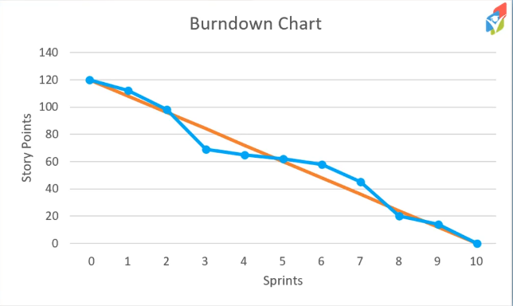
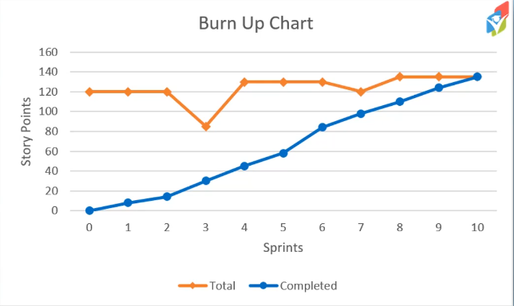

# 51. Stats

## Team Velocity

What is the average total Story Points we can complete as a team per sprint?

| Product Backlog | Commited (in sprint) | Completed (in sprint)
|:---:|:---:|:---:|
| 3 | 3 | 3 |
| 3 | 3 | 3 |
| 2 | 2 | 1 |
| 5 | 1 | 5 |
| 3 | 5 | 1 |
| 3 | 1 | **Actual velocity: 10 points** |
| 1 | **Estimated velocity: 12 points** | |
| 5 | | |
| 1 | | |
| 2 | | |
| **Total points: 28** |  |  |

Overtime you can review how you did with the help of previous sprints.
This will help for future sprint estimates.

## Burndown chart

A diagram revealing the trend of a project:
- **Vertical axis**: Story Points
- **Horizontal axis**: Sprints
- One line representing the goal trajectory (orange)
- One line with a data point for each sprint showing the actual amount of Story Points at a certain Sprint (blue)

This will help reveal if the current trend is going up or down.

## Burn up chart

Since the plan can change during a project, and many things are uncertain, there's an alternative tool to the Burndown chart: Burn up chart

- **Vertical axis**: Story Points
- **Horizontal axis**: Sprints
- One line with a data point for each sprint representing the total amount of Story Points for this project (orange)
- One line with a data point for each sprint showing the amount of Story Points that has been completed (blue)

Comparing both charts with each other on the same set of data, it shows that te Burndown chart doesn't give you all the information as the Burn up chart do.

## Chart for non-fibonacci estimates

You can use them, but they are not as useful.

Instead of Story point, you could have number of User Stories.
Doesn't take account to the actual size of the stories.

Or sizes any other framework can be converted in to arbitrary number, such as the fibonacci sequence.

## Responsibilities

The Scrum Master creates the charts.
Or if you use an automated tool, then that is taken care of that way.

## Scrum Term Matching

- **Sprint**: a time-box (a specific set of time)
- **Courage**: VALUE: do the right thing and work on tough problems
- **Definition** of ready: user story contains enough details to be worked on
- **Product increment**: vertical slice of a potential shippable product
- **Burndown chart**: Visual aid that show trending of user stories completed
- **Sprint retrospective**: share lessons learned from the previous iteration
- **Scrum Master**: servant leader that removes roadblocks
- **Focus**: VALUE: complete the right work based on sprint goals
- **Sprint review**: meeting to demo progress made during the iteration
- **User story**: Simple description of a feature from a user's perspective
- **Sprint backlog**: committed user stories for upcoming iteration
- **Product owner**: tasked with understanding the product vision
- **Sprint planning**: discussion and commitment for the next iteration's work
- **Respect**: VALUE: treat everyone as a capable team member
- **Product backlog**: prioritized list of user stories that grows and changes
- **Definition of done**: common understanding of when something is completed
- **Daily standup/scrum**: discussion of yesterday's progress, today's plan, and issues
- **Working agreement**: team-created list of rules, expectations, and procedures
- **Openness**: VALUE: discuss the work and challenges of the project
- **Developers**: self-organizing, cross-functional group of people
- **Burn up chart**: compares total user stories versus completed user stories
- **Team velocity**: number of story points that are complted per iteration
- **Commitment**: VALUE: give 100% effort to achieve project team's goals
- **Work in progress**: workthat is currently being completed
