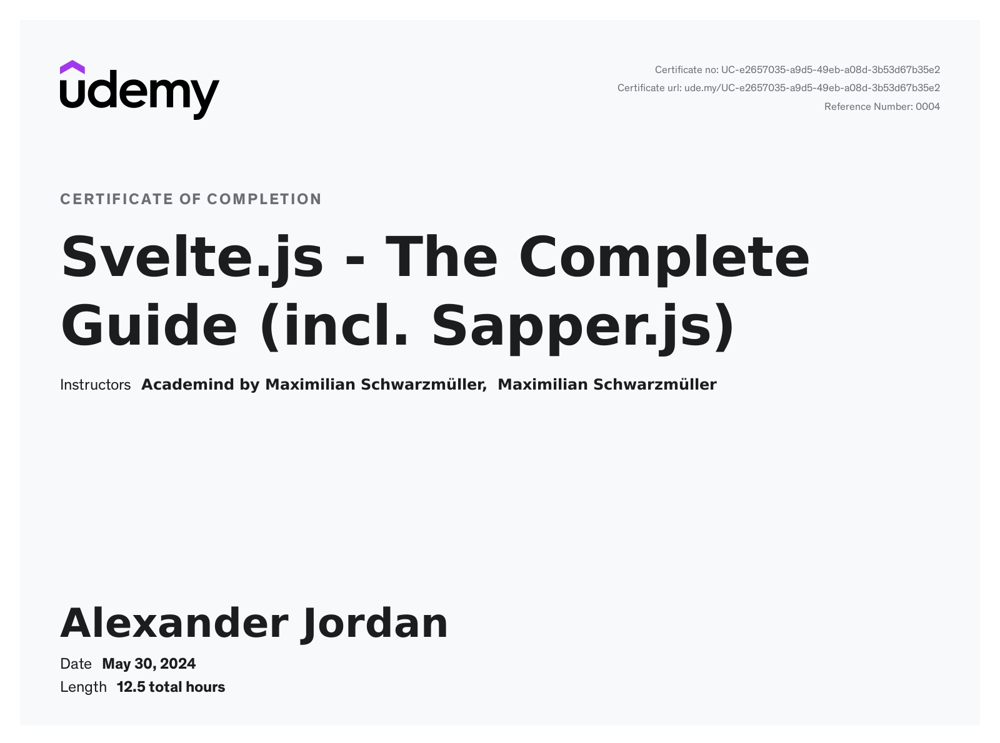

# Svelte.js - The Complete Guide (incl. Sapper.js)

These are my personal notes and projects from going through the [Svelte.js - The Complete Guide (incl. Sapper.js)](https://www.udemy.com/course/sveltejs-the-complete-guide/) course taught by [Academind by Maximilian Schwarzmüller](https://www.udemy.com/user/academind/).

NOTE: I've also adjusted some of the notes and projects to use Svelte-Kit instead of Sapper.

[My certification](https://www.udemy.com/certificate/UC-e2657035-a9d5-49eb-a08d-3b53d67b35e2/):

